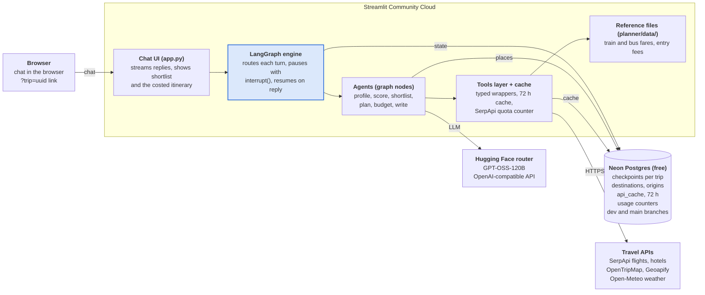
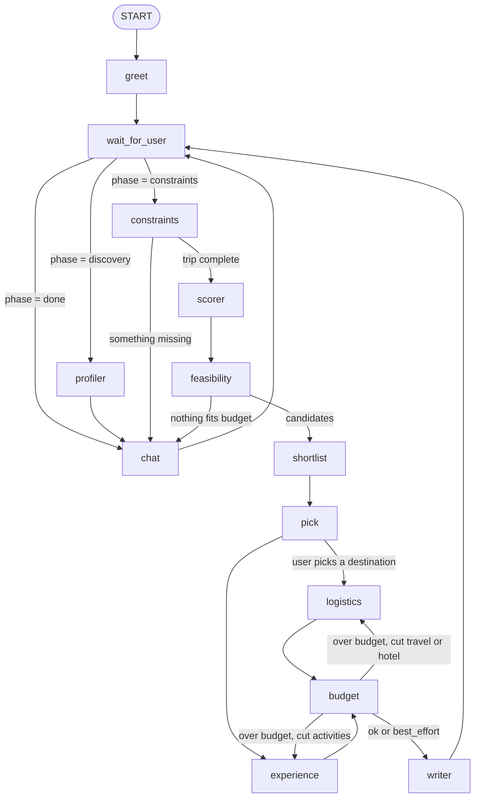

# Architecture

One Streamlit app talks to Neon Postgres and five outside services. The browser only talks to the app, and Neon is the one place state lives, so a sleeping or redeployed app loses nothing.

See [hld.md](hld.md) for the components and flows, and [lld.md](lld.md) for the detail behind each box.

## System view

Arrows point from caller to callee. The LangGraph engine is the core: it saves state to Neon after every step and hands each turn to the right agent.

The same picture as an image, for places that don't render Mermaid: [architecture.png](architecture.png).

## Agent graph

Thirteen LangGraph nodes. `logistics` and `experience` run in parallel; `budget` sends the plan back to one of them, up to 3 rounds, before `writer` runs. Every `wait_for_user` and `pick` is an `interrupt()` that saves state to Neon and waits for the next message or click.

Use two plain edges into `budget` (`logistics -> budget` and `experience -> budget`), not the list form `add_edge(["logistics", "experience"], "budget")`. The list form waits for both nodes, so the retry loop stalls the first time only one of them re-runs. This was checked on LangGraph 1.2.
