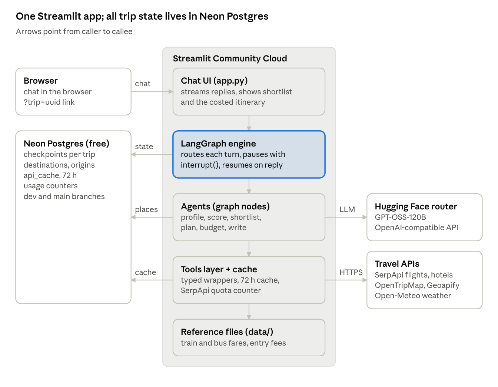

# High-level design

The planner is a single Python app on Streamlit Community Cloud. Inside it, a LangGraph graph runs the agents, plain-Python tools fetch prices, and every pause is saved to Neon Postgres. The model, prices and places come from external APIs.

## Architecture

The browser only talks to the Streamlit app; the app makes every outside call, and Neon is the one place state lives, so a sleeping or redeployed app loses nothing.

The Mermaid version of this diagram, plus the agent graph, is in [Architecture.md](Architecture.md).

The LangGraph engine (highlighted) is the core: it saves state to Neon after every step and hands each turn to the right agent.

## Components

The app is one Python process on Streamlit Community Cloud; everything else is a managed free service it calls over HTTPS.

| Component | Lives in | Responsibility | Talks to |
| --- | --- | --- | --- |
| Chat UI | `app.py` | Renders the conversation, streams replies, shows the shortlist and itinerary, keeps the trip id in the URL | LangGraph engine |
| LangGraph engine | `planner/graph/` | Runs the state machine: routes each turn, pauses for the user with `interrupt()`, resumes with `Command(resume=...)` | LLM, tools, checkpointer |
| Agents (nodes) | `planner/graph/nodes/` | Profiler, scorer, constraints, feasibility, shortlist, logistics, experience, budget, writer | LLM, tools, data tables |
| LLM client | `planner/llm.py` | One cached `ChatOpenAI` pointed at the Hugging Face router, model GPT-OSS-120B | Hugging Face Inference Providers |
| Tools layer | `planner/tools/` | Typed wrappers for flights, hotels, attractions, weather, fare tables | SerpApi, OpenTripMap, Geoapify, Open-Meteo, cache |
| Cache | `planner/cache.py` | Stores API responses for up to 72 h and counts SerpApi calls against the monthly quota | Neon Postgres |
| Checkpointer | `planner/db.py` | Saves graph state after every step so a trip survives a restart or app sleep | Neon Postgres |
| Reference data | `planner/data/` + Neon tables | Curated destinations, origin cities, train and bus fare charts, entry fees | Read by agents |

Agents never call an API directly; they go through the tools layer, so caching and quota rules live in one place.

## Key flows

Every user message is one graph run that ends at the next `interrupt()`; the checkpointer saves state in between, so nothing is held in Streamlit memory.

**1. A discovery turn**

1. The user types a reply; `app.py` resumes the graph with `Command(resume=text)` and the trip id as `thread_id`.
2. `wait_for_user` turns the text into a `HumanMessage`; the orchestrator routes on `phase`.
3. The profiler extracts mood, pace and interests into `preferences` and asks the next question, streamed token by token.
4. The graph pauses at `wait_for_user`; state is written to Neon.

**2. Picking a destination**

1. Once preferences are complete, the constraints node asks for origin, dates, nights, travellers, budget and modes.
2. The scorer ranks the curated destination table against preferences; feasibility drops any destination whose cost floor exceeds the budget.
3. The shortlist node writes a reason for each of the top 5, and the pick node shows them with a price range, then pauses with `interrupt()`.
4. The user picks one; `selected_destination` is set and the phase moves to planning.

**3. Building the itinerary**

1. Logistics (flights, trains, buses, hotels) and experience (attractions, weather, day plan) run in parallel through the tools layer.
2. The budget controller adds up every priced item in Python. Over budget, it asks logistics or experience for cheaper options, up to 3 rounds.
3. After 3 rounds it accepts the closest plan and marks it `best_effort`.
4. The writer turns the priced plan into a day-by-day itinerary with a cost table and each price's source and age.

[Architecture.md](Architecture.md) draws the agent graph; [LLD.md](LLD.md) lists every node and edge.

## Data stores

One Neon Postgres database holds all state; static reference files ship in the repo. Use the `dev` branch locally and `main` for the deployed app.

| Store | Where | Holds | Written by | Freshness rule |
| --- | --- | --- | --- | --- |
| Checkpoints | Neon, tables made by `PostgresSaver.setup()` | Full graph state per trip id, every step | LangGraph | Kept until deleted |
| `destinations` | Neon | Curated Indian destinations with tags, best months, hotel price bands, daily spend | Seed script | Edited by hand |
| `origins` | Neon | Origin cities with nearest airport and main railway station codes | Seed script | Edited by hand |
| `api_cache` | Neon | Raw API responses keyed by provider and request hash | Tools layer | Ignored after 72 h |
| `usage` | Neon | SerpApi calls per month and LLM tokens per trip | Tools layer, LLM wrapper | Reset monthly |
| Fare charts | `planner/data/*.csv` in the repo | Train fare per km by class, bus fare per km by type | You, by hand | Labelled as estimates |
| Entry fees | `planner/data/entry_fees.csv` | Ticket prices for major attractions | You, by hand | Labelled with the date checked |
| Secrets | `.streamlit/secrets.toml` locally, app settings on Streamlit Cloud | HF token, SerpApi key, Geoapify and OpenTripMap keys, database URL | You | Never committed |

## Non-functional requirements

Infrastructure costs nothing; the limits that matter are the free-tier quotas and cold starts, so the design caches hard and saves state on every step.

| Area | Target | How the design meets it |
| --- | --- | --- |
| Responsiveness | First token of a chat reply on screen within a few seconds | Stream tokens with `stream_mode="messages"`; only the `chat` and writer nodes stream |
| Itinerary run | One full plan without the user waiting on a frozen page | Logistics and experience run in parallel; a spinner names the step running |
| Cost | $0 for hosting and database; LLM paid per use from HF credits | Streamlit Community Cloud, Neon free, `usage` table tracks tokens per trip |
| SerpApi quota | Stay under 250 searches a month | 72 h cache, a monthly counter that switches to cached or estimated prices at the limit |
| Cold starts | App and database wake on first visit | Streamlit sleeps after 12 h idle and Neon suspends after 5 min; the pool's `check_connection` reconnects |
| Durability | No trip lost to a restart, redeploy or sleep | `PostgresSaver` checkpoint after every node; trip id in the URL |
| Failure handling | A failed API or LLM call never ends the trip | Retry button resumes from the last checkpoint; tools fall back to cache, then to estimates |
| Price honesty | Every price shows its source and age | `PricedItem` carries `source`, `fetched_at`, `is_estimate` |
| Security | No secret in git, no personal data stored | Secrets in `secrets.toml` and Streamlit settings; trips hold no names, phones or emails |
| Privacy of trips | A trip is visible only to whoever has its link | Random UUID trip id; anyone with the link can open it, which is fine for a portfolio demo |

## Design decisions

Each choice below favours free tiers, one language and fewer moving parts over scale, which suits a portfolio app.

| Decision | Chosen | Instead of | Why |
| --- | --- | --- | --- |
| UI and hosting | Streamlit on Community Cloud | React + FastAPI on a VM | One Python codebase, free hosting, deploy on push to `main` |
| Database | Neon Postgres free | Self-hosted Postgres on a VM | Managed, free, branches for dev and prod, works with `PostgresSaver` |
| Agent framework | LangGraph | CrewAI, plain function calls | Explicit state, `interrupt()` for human-in-the-loop, durable checkpoints |
| Model | GPT-OSS-120B via the Hugging Face router | Paid OpenAI or Anthropic APIs | Your choice; OpenAI-compatible API so `ChatOpenAI` works unchanged |
| Arithmetic | Python adds up every cost | Asking the LLM for totals | LLMs miscount; totals must match the line items |
| Destinations | Curated table in Neon | Letting the LLM invent places | Scored, repeatable, and every place has known price bands |
| Flights and hotels | SerpApi (Google Flights and Hotels) | Amadeus self-service | Amadeus self-service closed; SerpApi has a free monthly quota |
| Attractions | OpenTripMap + Geoapify | Google Places | No billing account needed |
| Trains and buses | Fare charts in the repo, marked as estimates | Live rail APIs | No free, reliable live fare API for Indian Railways or buses |
| Weather | Open-Meteo | Paid weather APIs | Free, no key |
