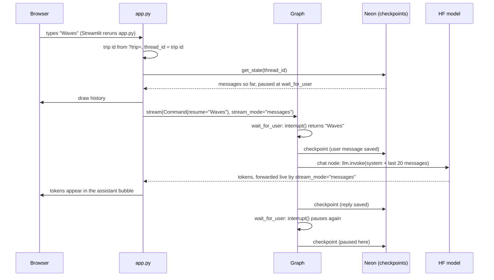

# Phase 2 guide: the durable chat loop

Phase 1 kept the conversation in `st.session_state`, so closing the tab or a sleeping app lost it. Phase 2 moves the conversation into a LangGraph graph whose state is saved to Neon Postgres after every step. The user sees the same chat, but it now survives restarts, can be reopened from a link, and recovers from a failed model call with a Retry button.

This guide explains what each file does and, more importantly, why it is written that way. Read it alongside the code; the comments in each file go into the line-level detail.

## What runs when the user sends a message



The key idea is that **nothing about the conversation lives in the Python process**. Each rerun of `app.py` loads the trip from Postgres, and each graph step saves it back. That is why a redeploy or a sleeping app loses nothing.

## The graph

```text
START -> greet -> wait_for_user -(route)-> chat -> wait_for_user -> ...
```

`wait_for_user` pauses with `interrupt()`, so a graph run never reaches the end. It always stops at the next pause, and the next message resumes it.

## File by file

### `planner/graph/state.py`: what is remembered

- `TravelState` is a `TypedDict`: the shape of the dict that gets saved.
- `messages` uses the `add_messages` **reducer**. A node returns `{"messages": [new_msg]}`, and LangGraph appends instead of replacing. Every other key is simply overwritten.
- Other keys are `NotRequired` because a new trip only has `messages`. Code must use `state.get("phase", default)`.
- **Why plain dicts and not Pydantic models in state:** checkpoints are stored for a long time. If state held Pydantic objects, renaming a field later would break every saved trip. Plain JSON survives model changes, and nodes validate on read with `model_validate()`.
- The keys for later phases are declared now so the schema matches LLD.md in one place.

### `planner/graph/nodes/chat.py`: the three nodes

- **`greet`** returns a fixed message, so opening a trip costs no LLM call and can't fail on the model.
- **`wait_for_user`** is the human-in-the-loop point. The first time it runs, `interrupt()` stops the graph and saves "paused here". When `app.py` sends `Command(resume=text)`, LangGraph re-runs this node **from its first line**, and `interrupt()` returns the text.
  - Lesson: code before `interrupt()` runs twice, so it must have no side effects.
  - The resume value is validated (non-empty string) because it comes from outside, like any user input.
- **`make_chat(llm)`** is a factory that returns the `chat` node with the model baked in. This is **dependency injection**: production passes the Hugging Face model, tests pass a fake. The node never knows which, and never reads secrets.
- `chat` calls `llm.invoke`, not `llm.stream`. When the graph runs with `stream_mode="messages"`, LangGraph hooks into the call and forwards each token, while the node still gets one complete message to save.

### `planner/graph/nodes/orchestrator.py`: who runs next

- `route()` reads `phase` and returns the next node's name. It is a pure function (no LLM, no I/O), so `tests/test_orchestrator.py` tests every case in one line each.
- It already encodes the full design (profiler, constraints, chat), even though Phase 2 only has `chat`.

### `planner/graph/build.py`: wiring

- `build_graph(llm, checkpointer)` takes its dependencies as arguments. The same function builds the production graph and the test graph.
- `ROUTE_MAP` translates `route()`'s answers into nodes that exist. In Phase 2, `"profiler"` and `"constraints"` both map to `"chat"`. The phase that adds each agent changes one line (`"profiler": "profiler"`) and leaves `route()` alone. A test checks that the map never points at a missing node.
- `STREAMING_NODES = {"chat", "writer"}` lists the nodes whose LLM output is meant for the user. Later, the profiler will make LLM calls that return JSON, and the UI must not show those.
- `compile(checkpointer=...)` is what makes the graph durable.

### `planner/db.py`: the database connection

- **Connection pool** (`psycopg_pool.ConnectionPool`): opening a TLS connection to Postgres is slow. A pool keeps a few open and lends them out.
- **`@st.cache_resource`**: Streamlit reruns the script on every click, and this makes the pool and checkpointer be created once per server process, not once per click.
- Each setting answers a real failure:

| Setting | Problem it solves |
| --- | --- |
| `autocommit=True`, `row_factory=dict_row` | Required by `PostgresSaver` |
| `prepare_threshold=0` | `DATABASE_URL` is Neon's **pooled** endpoint (PgBouncer, transaction mode). Consecutive statements can hit different server connections, so prepared statements break |
| `check=ConnectionPool.check_connection` | Neon suspends after 5 idle minutes and drops connections; each connection is tested before use and replaced if dead |
| `max_lifetime=30 min` | Recycles connections before the server closes them |
| `min_size=1`, `max_size=5` | Neon's free tier has a small connection limit |
| `open=True` | A wrong `DATABASE_URL` fails at startup with a clear error, not on a user's message |

- `checkpointer.setup()` creates LangGraph's own tables and is safe to run on every start.

### `app.py`: the UI

- **Trip id in the URL (`?trip=<uuid>`).** Session state dies with the tab, but a URL can be bookmarked. The id is the graph's `thread_id`, which is how the checkpointer knows which trip to load.
  - The id is user-editable, so only valid UUIDs are accepted; anything else starts a new trip.
  - Random UUIDs can't be guessed, which is the whole privacy model (HLD.md: "visible only to whoever has its link").
- **`get_graph()` is cached** per process. Sharing one compiled graph between users is safe because it holds no user data.
- **Three states after drawing history:**
  1. `snapshot.interrupts` set: paused at `wait_for_user`, so show the chat input.
  2. `snapshot.next` set with no interrupt: a node crashed mid-run. Show the error and a **Retry** button, and hide the chat input, since there is no pause for new text to resume.
  3. Neither: can't happen yet; the loop never ends.
- **Retry** calls the graph with input `None`, meaning "continue from the last checkpoint". The user's message was saved before the failed node, so nothing is lost or retyped. This even works after closing the tab, because the stopped run is in Postgres.
- **Errors:** the full exception goes to the log (`logger.exception`, visible in Streamlit Cloud's logs). The user gets a short message. Phase 1 showed raw exception text, which can leak hostnames, request ids or SQL.
- **Streaming filter:** `stream_mode="messages"` yields `(token, metadata)` for every message in every node. Only tokens from `STREAMING_NODES` are shown.

## Testing strategy

Each layer is tested with the cheapest tool that can catch its bugs. The default `uv run pytest` needs no network, keys or database.

| File | Layer | How |
| --- | --- | --- |
| `tests/test_orchestrator.py` | Routing rules | Plain function calls |
| `tests/test_graph.py` | Graph logic: pause, resume, retry, restart, trip isolation, history cap | Real graph + `InMemorySaver` + fake models |
| `tests/test_app.py` | UI: trip id in URL, reopening a link, Retry, New trip, database down, LLM settings | Streamlit `AppTest`, with `get_llm` and `get_checkpointer` swapped for fakes |
| `tests/test_integration.py` | Real Neon + real model, end to end | Skipped unless `RUN_INTEGRATION=1`; cleans up its trip |
| `tests/fakes.py` | Shared fakes | `FlakyModel` fails N times then answers; `RecordingModel` records what it was sent |

Things worth noticing:
- `InMemorySaver` and `PostgresSaver` share an interface, so graph tests exercise the same pause and resume logic without a database. Only the integration test needs Neon.
- The app tests clear `st.cache_resource` before each test (a fixture in `test_app.py`). Otherwise the graph cached by one test, with its fake model, would leak into the next.
- `test_state_survives_a_new_graph_instance` simulates an app restart, and `test_reopening_the_link_restores_the_conversation` simulates a new browser session.

## Commands

```bash
uv run pytest                                              # fast, offline
RUN_INTEGRATION=1 uv run pytest tests/test_integration.py  # real Neon + model (bash)
uv run streamlit run app.py                                # the app
```

In PowerShell, set the variable first: `$env:RUN_INTEGRATION=1; uv run pytest tests/test_integration.py`.

## What Phase 2 leaves for later

- **Token logging:** the model already returns token counts (`stream_usage=True`). Writing them to the `usage` table belongs with `planner/cache.py` and the tables from LLD.md.
- **`ui/` package:** LLD.md puts rendering in `ui/chat.py`. `app.py` is still small enough to read in one go; splitting it makes sense once the shortlist cards and itinerary view arrive.
- **Agents:** the profiler and constraints nodes (the next phase; the docs do not number it yet) plug in through `ROUTE_MAP`.
